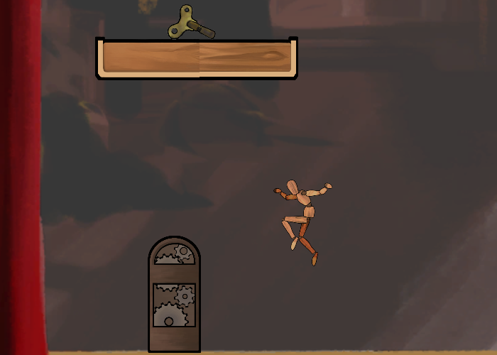
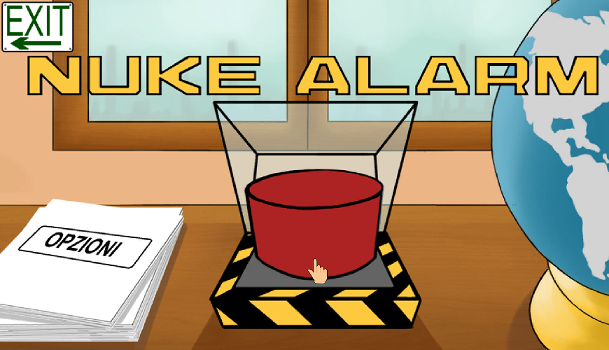
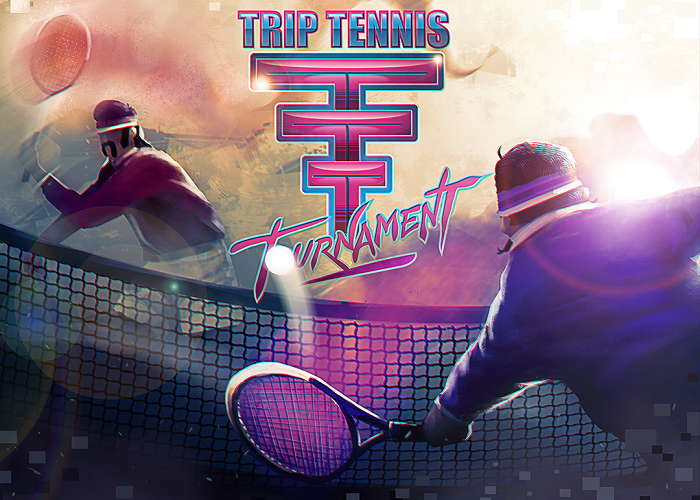

# About Me

I'm a Unity 3D game developer and i'm attending the third year at [TheSign Comics & Arts Academy](https://thesign.academy/) in Florence.

# Games

 ## [The Greatest Show](https://github.com/a-pucci/The_Greatest_Show)

2D puzzle game where you are a puppet able of switching between two worlds.
You have to find all machine's gears spread in these two worlds.

Build: <a href="d./Builds/the_greatest_show_build" download="FILENAME">windows</a>

 

## [Nuke Alarm](https://gitlab.com/a-pucci/NukeAlarm)

Puzzle game where you are president's secretary.
You have to find out if recieved threats are real or fake trying to avoid a nuclear war.

Build: <a href="d./Builds/nuke_alarm_build" download="FILENAME">windows</a>

## [Trip Tennis Tournament](https://gitlab.com/Calosi/triptennistournament)

Competitive local multiplayer game based on tennis in a vaporwawe atmosphere.

Build: <a href="d./Builds/trip_tennis_tournament_build" download="FILENAME">windows</a>

---

## Other Projects

- [**Arduino**](https://github.com/a-pucci/Arduino_Projects) Projects using Arduino MKR1000

# Contacts

* Email: <a_pucci@hotmail.it> - or - <alessandro.pucci1990@gmail.com>
* GitHub: <https://github.com/a-pucci>